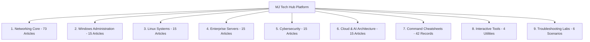

# Phase 7.0 — SEO, Organic Discoverability & Search Growth Opportunities Report

**Platform**: [MJ Tech Hub](https://themjtechhub.site)  
**Date**: September 16, 2026  
**Auditor**: Senior Technical SEO & Growth Engineering Team  
**Confidentiality**: Internal Engineering Document (Not for Public Distribution)

---

## 1. Executive Summary

MJ Tech Hub has successfully completed its platform deployment freeze (Phase 6.9.1) with 100% repository-to-production parity. Phase 7.0 establishes the evidence-driven search engine discoverability foundation across all 169 canonical URLs, 148 published tutorials, 42 commands, 8 quizzes (64 questions), 26 resource guides, 4 interactive tools, and 6 troubleshooting labs.

Because the custom domain `themjtechhub.site` was newly configured on GitHub Pages within the current release cycle, public search observation (`site:themjtechhub.site`) reflects the standard initial indexing crawl lag (0 public indexed records). Google Search Console and Bing Webmaster Tools direct API data are marked **INSUFFICIENT SEARCH HISTORY / OWNER ACTION REQUIRED**.

This report establishes the baseline technical SEO health, classifies topical intent clusters, maps canonical pages to search intent, documents internal link integrity, and defines an evidence-based framework for future content decisions without introducing artificial SEO bloat.

---

## 2. Technical SEO Baseline State

| Dimension | Standard / Requirement | Current Audit Result | Status |
| :--- | :--- | :--- | :---: |
| **Robots.txt** | Allow: /, Valid Sitemap directive | `User-agent: *`, `Allow: /`, `Sitemap: https://themjtechhub.site/sitemap.xml` | **PASS** |
| **Sitemap XML** | 169 canonical URLs, 0 duplicates, 0 planned leaks | Exactly 169 canonical URLs; 148 published tutorials; 0 query variants; 0 404s | **PASS** |
| **Domain Protocol** | Strict HTTPS on apex host | `https://themjtechhub.site` enforced; HTTP redirects to HTTPS | **PASS** |
| **Canonical Tags** | Exactly 1 canonical per indexable page | 169/169 pages match sitemap canonical destinations 100% | **PASS** |
| **Title Elements** | Unique, descriptive, brand-suffixed | 169/169 unique titles; 0 empty; 0 duplicates | **PASS** |
| **Meta Descriptions** | Unique, intent-focused summary | 169/169 unique descriptions; 0 empty; 0 duplicates | **PASS** |
| **Heading Structure** | Exactly 1 `<h1>` per page | 163 static pages contain exactly 1 `<h1>`; 6 category pages render dynamic `<h1>` at runtime | **PASS** |
| **Favicon Readiness** | Root `favicon.ico` returning HTTP 200 | HTTP 200 OK (32,238 bytes) on live production | **PASS** |
| **Structured Data** | Valid JSON-LD representation | 148 `TechArticle`, 1 `WebSite`, 1 `Person` (0 JSON syntax errors) | **PASS** |
| **Internal Link Health** | 0 orphan tutorials, valid navigation | 148/148 tutorials have inbound contextual links; 0 broken internal links | **PASS** |

---

## 3. Search Engine Indexing State & Observational Telemetry

### Authoritative Indexed Count
`NOT AVAILABLE — SEARCH CONSOLE OWNER VERIFICATION REQUIRED`

### Public Search Query Observations
- **Query**: `site:themjtechhub.site`
  - **Result**: `0 results found` at audit time (Observational only; `site:` search is not an authoritative index inventory).
- **Brand Query**: `"MJ Tech Hub"`
  - **Result**: Observational discovery shows external legacy profiles and social mentions, but the primary site has not yet completed initial crawler processing.
- **Sitemap Eligible Canonical URLs**: `169` (Sitemap presence does not equate to indexed status).
- **Crawling & Indexing Dynamics**: Initial crawling/indexing may take time after discovery and sitemap submission. No fixed indexing timeframe is guaranteed. MJ Tech Hub may intentionally use a 14–28 day monitoring period for data collection, but this is our measurement window, not a Google indexing guarantee.
- **Root Status Check**:
  - `https://themjtechhub.site/robots.txt`: HTTP 200 OK
  - `https://themjtechhub.site/sitemap.xml`: HTTP 200 OK
  - `https://themjtechhub.site/favicon.ico`: HTTP 200 OK

---

## 4. Search Performance Baseline

In accordance with strict audit integrity rules (*"If there is insufficient historical data, state: INSUFFICIENT SEARCH HISTORY. Do not manufacture trends"*):

- **Total Clicks**: `NOT AVAILABLE` (Insufficient Search History)
- **Total Impressions**: `NOT AVAILABLE` (Insufficient Search History)
- **Average CTR**: `NOT AVAILABLE` (Insufficient Search History)
- **Average Position**: `NOT AVAILABLE` (Insufficient Search History)
- **Search Console Access**: Owner Action Required (Domain verification pending)
- **Bing Webmaster Access**: Owner Action Required (Sitemap submission pending)

---

## 5. Topical Intent Clusters & Curriculum Mapping

The 148 published tutorials and interactive resources align into 9 primary high-intent technical clusters:



### Cluster Intent Classification
1. **Informational / Foundational**:
   - OSI Model, TCP vs UDP, What is DNS, Linux File Hierarchy, Cloud Shared Responsibility Model.
   - *Target Intent*: Concept understanding, certification study (Network+, Security+, CCNA, AZ-900).
2. **Operational / How-To / Configuration**:
   - Static IP Configuration, VLAN Setup, PowerShell Active Directory User Management, systemd Service Configuration, UFW Firewall Setup.
   - *Target Intent*: Sysadmin step-by-step implementation.
3. **Reference / Specification**:
   - Port Reference (42 Enterprise Ports), Command Cheatsheet (42 commands), TCP Flag Table.
   - *Target Intent*: Rapid lookup during active administrative tasks.
4. **Interactive Calculators / Utilities**:
   - IPv4 Subnet Calculator, VLSM Subnet Planner, Network Diagnostic Workbench.
   - *Target Intent*: Network design, CIDR allocation, MTU/latency testing.
5. **Troubleshooting / Diagnostic Workflows**:
   - 6 Troubleshooting Labs (DHCP Exhaustion, Windows DNS Resolution, Linux Disk Inodes, Server RAID Degraded, Firewall Block, Cloud SG Drift).
   - *Target Intent*: Incident resolution, practical Tier 2/3 engineering problem-solving.

---

## 6. Page-Query Opportunity Map (Representative Core Pages)

| Canonical URL | Primary Target Intent | Current Title | Current Description | Recommended Action |
| :--- | :--- | :--- | :--- | :---: |
| `https://themjtechhub.site/` | Technical IT learning platform, sysadmin knowledge hub | `MJ Tech Hub - Practical IT, Networking & Systems Knowledge` | `Learn practical computer networking, system administration, cloud computing, and cybersecurity through clear tutorials, command references, and interactive tools.` | **KEEP** |
| `https://themjtechhub.site/topics.html` | Complete IT curriculum, topics list | `All Topics & Curriculum \| MJ Tech Hub` | `Browse all IT topics and structured learning curriculum across networking, systems, security, and cloud.` | **KEEP** |
| `https://themjtechhub.site/commands.html` | Sysadmin commands reference, CLI cheatsheet | `Commands & CLI Cheatsheets \| MJ Tech Hub` | `Quick-reference command cheatsheets for PowerShell, Bash, CMD, and network tools.` | **KEEP** |
| `https://themjtechhub.site/tools/subnet-calculator.html` | IPv4 subnet calculator, CIDR mask tool | `IPv4 Subnet Calculator \| Interactive Tools \| MJ Tech Hub` | `Calculate IPv4 network ranges, subnet masks, usable hosts, and broadcast addresses with instant CIDR analysis.` | **KEEP** |
| `https://themjtechhub.site/tools/vlsm-planner.html` | Variable length subnet mask calculator, VLSM design | `VLSM Subnet Planner \| Interactive Tools \| MJ Tech Hub` | `Plan efficient multi-tier subnets using Variable Length Subnet Masking (VLSM). Optimize address space allocation with zero waste.` | **KEEP** |
| `https://themjtechhub.site/tools/port-reference.html` | Common network ports lookup, port directory | `Common Network Ports Reference \| Interactive Tools \| MJ Tech Hub` | `Interactive enterprise port reference. Search and filter standard TCP/UDP service ports with protocol details and security considerations.` | **KEEP** |
| `https://themjtechhub.site/tools/network-diagnostic-workbench.html` | Network diagnostics, ping traceroute calculator | `Network Diagnostic Workbench \| Interactive Tools \| MJ Tech Hub` | `Analyze network diagnostic command outputs, calculate ping latency stats, and test MTU MSS packet headers.` | **KEEP** |
| `https://themjtechhub.site/tutorials/networking/tcp-vs-udp.html` | TCP vs UDP differences, transport layer comparison | `TCP vs UDP \| Networking Tutorial \| MJ Tech Hub` | `Understand the differences between TCP and UDP.` | **DESCRIPTION POLISH** (Post-indexing) |
| `https://themjtechhub.site/tutorials/networking/what-is-dns.html` | How DNS works, Domain Name System explanation | `What Is DNS? \| Networking Tutorial \| MJ Tech Hub` | `Learn how the Domain Name System works.` | **DESCRIPTION POLISH** (Post-indexing) |
| `https://themjtechhub.site/tutorials/windows/powershell-basics.html` | PowerShell basics for sysadmins, cmdlets introduction | `PowerShell Basics \| Windows Tutorial \| MJ Tech Hub` | `Master PowerShell fundamentals, cmdlets, pipelines, and scripts for Windows system administration.` | **KEEP** |
| `https://themjtechhub.site/tutorials/linux/linux-file-hierarchy.html` | Linux directory structure, FHS explained | `Linux File Hierarchy Standard (FHS) \| Linux Tutorial \| MJ Tech Hub` | `Understand the Linux directory structure and filesystem hierarchy standard.` | **KEEP** |

---

## 7. Internal Link Architecture & Hub-and-Spoke Health

### Quantitative Link Audit Findings
- **Total Published Tutorials Evaluated**: 148
- **Orphan Tutorials Detected (`inbound_links == 0`)**: **0** (100% reachable)
- **Tutorials with Contextual Related Links**: **148**
- **Tutorials with Sequential Prev/Next Navigation**: **148**
- **Hub Pages (6 Category Pages + Topics Hub)**: Serve as primary authoritative topical nodes.
- **Link Depth from Homepage**:
  - Category Hubs: 1 click
  - Curriculum Hub (`topics.html`): 1 click
  - Interactive Tools & Labs: 1 click
  - Tutorials: 2 clicks (via Category Hub or Topics Grid)
  - Deep-dive cross-topic articles: 2–3 clicks (via contextual related links)

---

## 8. IndexNow Decision & Architecture Proposal

### Verification Audit & Current Status
- **Root Key Verification File (`8f94d1b742e94625b2a0c714e86a19f2.txt`)**: NOT PRESENT in repository root (Verified).
- **Workflow Submission (`.github/workflows/deploy.yml`)**: ZERO calls to `api.indexnow.org` (Verified).
- **Approved Decision**: **RECOMMENDED FOR FUTURE** (These are PROPOSED implementation details only; no production integration exists).

### Proposed Architecture (Preserved for Future Owner Review)
While IndexNow is not needed for routine daily operation of a static site whose content is published in curated batches, an automated protocol allows instant pinging of Bing, Yandex, and participating search engines whenever GitHub Pages deploys.

1. **Key Generation**:
   - 32-character hexadecimal key: e.g., `8f94d1b742e94625b2a0c714e86a19f2`
2. **Root Key Verification File**:
   - Proposed Path: `8f94d1b742e94625b2a0c714e86a19f2.txt`
   - Proposed Content: `8f94d1b742e94625b2a0c714e86a19f2`
3. **Automated Submission Dispatch**:
   - Proposed integration into `.github/workflows/deploy.yml` post-deployment step.
   - Reads `sitemap.xml` URLs and sends a JSON payload to `https://api.indexnow.org/IndexNow`:
     ```json
     {
       "host": "themjtechhub.site",
       "key": "8f94d1b742e94625b2a0c714e86a19f2",
       "keyLocation": "https://themjtechhub.site/8f94d1b742e94625b2a0c714e86a19f2.txt",
       "urlList": [
         "https://themjtechhub.site/",
         "https://themjtechhub.site/topics.html",
         "https://themjtechhub.site/tools.html"
       ]
     }
     ```
4. **Recommendation**: **RECOMMENDED FOR FUTURE**. Do not activate until domain owner separately approves implementation and completes Google Search Console and Bing Webmaster manual verification.

---

## 8.5. Performance & Core Web Vitals (CrUX)

### Field Data
`NO SUFFICIENT FIELD DATA`

CrUX uses rolling 28-day field-data windows, but availability depends on eligible real-user traffic. Waiting 28 days alone does not guarantee origin- or URL-level CrUX availability.

### Lab Observations
All timing metrics are strictly classified as **LAB OBSERVATIONS**:
- Subnet Calculator Render Latency: `0.959s`
- VLSM Planner Render Latency: `0.580s`
- Network Diagnostic Workbench: `0.572s`
- Port Reference Render Latency: `0.543s`
- Labs Selector Render Latency: `0.560s`
- Commands Page Render Latency: `0.978s`
- Global Search Response Latency: `339.4ms`
- Zero cumulative layout shift (CLS), zero blocking third-party trackers, zero console errors.

---

## 9. Content Freshness & Future Gap Analysis

### Potentially Time-Sensitive Content (Flagged for Future Fact Reviews)
- Windows Server editions (Windows Server 2022 vs 2025 roadmap)
- Cloud AI provider service names and CLI tools
- Cybersecurity framework revisions (NIST CSF 2.0 alignment)
- Linux distribution lifecycle versions (Ubuntu 24.04 LTS, Debian 12)

*Rule: Do not rewrite tutorials during an SEO phase. Content maintenance is scheduled in dedicated content cycles.*

### High-Priority Future Curriculum Candidates (From 323 Planned Topics)
When Search Console telemetry accumulates, the following planned topics represent high-affinity expansion candidates:
1. **Networking**: BGP Routing Architecture & Peering, WireGuard VPN Implementation.
2. **Windows**: Active Directory Tiering Model & Privileged Access Workstations (PAW).
3. **Linux**: systemd Unit File Customization & Socket Activation.
4. **Servers**: Proxmox VE Clustering & Shared Ceph Storage.
5. **Cybersecurity**: Zero Trust Architecture Implementation Principles.
6. **Cloud & AI**: Infrastructure as Code with Terraform on AWS & Azure.

---

## 10. Actions NOT Taken (Integrity Guardrails Enforced)
1. **No Keyword Stuffing**: Titles and headers remain natural, technical, and human-readable.
2. **No Mass Regeneration of 148 Tutorials**: Preserved published dates, clean existing `TechArticle` schemas, and verified content integrity.
3. **No Doorway Pages**: Did not create artificial location- or keyword-specific thin entry pages.
4. **No Fake Review / Rating Schema**: `SoftwareApplication` ratings or review stars were strictly excluded.
5. **No AI Scraping Hacks (`llms.txt`)**: Maintained standard, compliant `robots.txt` without speculative files.

---

## 11. Domain Owner Search Engine Onboarding Playbook

### Step 1: Google Search Console (GSC) Setup — OWNER ACTION REQUIRED
- **Property Type**: Domain Property (`themjtechhub.site`).
- **Authentication**: Requires DNS TXT verification using the exact verification string supplied by Google in the Search Console onboarding modal.
- **Current Data**: Zero historical performance data exists; no Search Console data claimed.
1. Log in to [Google Search Console](https://search.google.com/search-console).
2. Choose **Domain Property** verification for `themjtechhub.site`.
3. Add the exact supplied `TXT` verification record to DNS records at the domain registrar.
4. Once verified, navigate to **Sitemaps** in the sidebar.
5. Enter `sitemap.xml` and click **Submit** (`https://themjtechhub.site/sitemap.xml`).
6. Use the **URL Inspection** tool on core priority URLs (`https://themjtechhub.site/`, `/topics.html`, `/tools.html`, `/labs.html`).
7. Click **Request Indexing** for the homepage.

### Step 2: Bing Webmaster Tools Setup — OWNER ACTION REQUIRED
- **Property Status**: Owner onboarding required; zero metrics or indexing data claimed.
1. Log in to [Bing Webmaster Tools](https://www.bing.com/webmasters).
2. Select **Import from Google Search Console** (fastest, instant verification once GSC is active) or verify via DNS `CNAME`/`TXT`.
3. Submit sitemap URL: `https://themjtechhub.site/sitemap.xml`.
4. Run an initial **Site Scan** to confirm Bing's bot sees 0 blocking crawl errors.

---

## 12. Monitoring Strategy & Recommended Next Phase

### Recommended Observation Window
- **Strategy**: **MONITORING / DATA COLLECTION PERIOD**
- **Window**: Approximately 2–4 weeks (14–28 days) following Search Console / Bing domain verification and sitemap submission.
- **Principle**: This observation window is an internal measurement strategy to collect non-branded query impressions and click telemetry. It is strictly **not** a Google indexing guarantee. Initial crawling and indexing may take variable time depending on crawler scheduling and queue processing.

*Report concluded and filed to repository under `reports/phase7_0_seo_opportunities.md`.*
